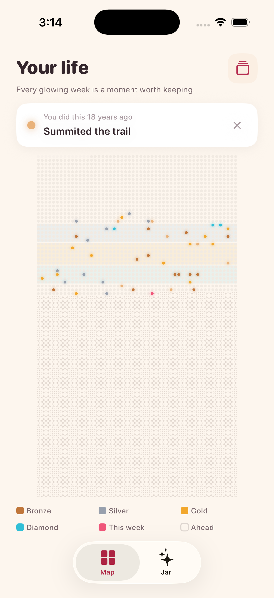
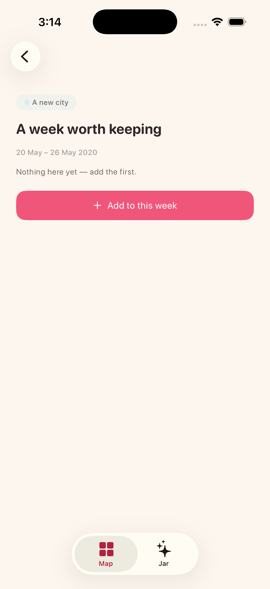
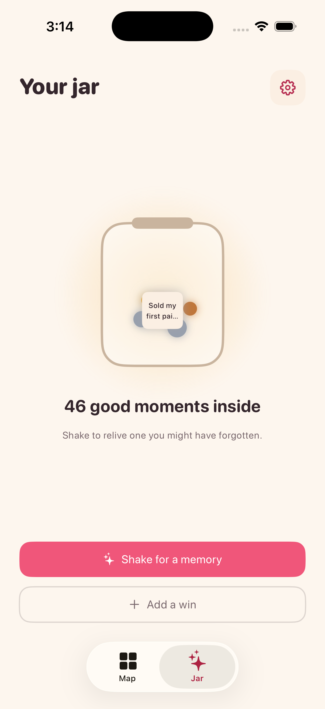
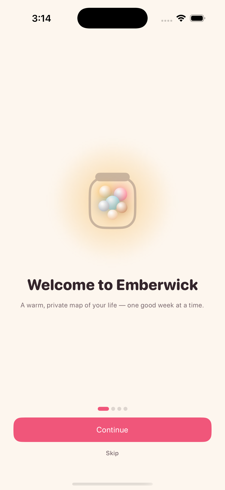
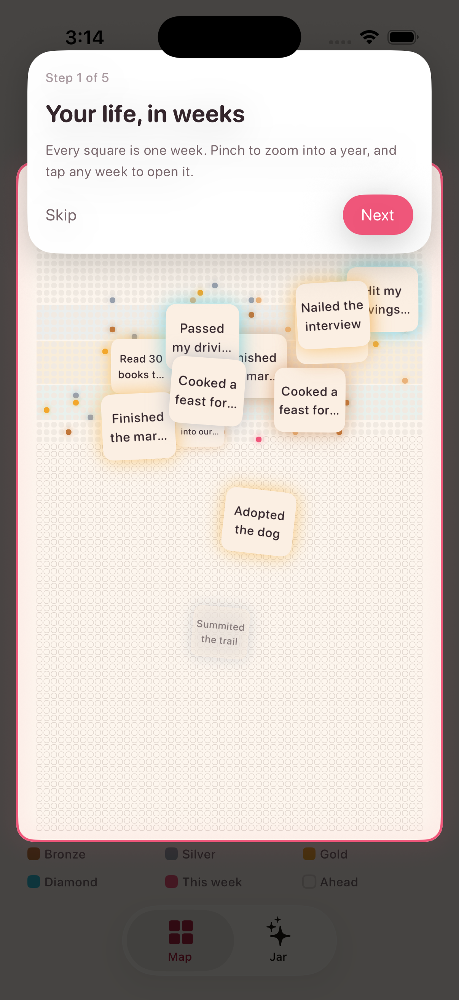
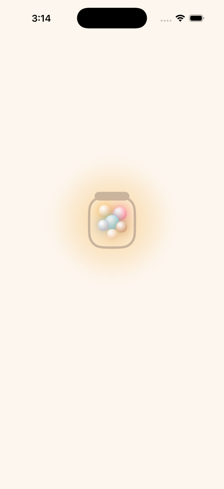
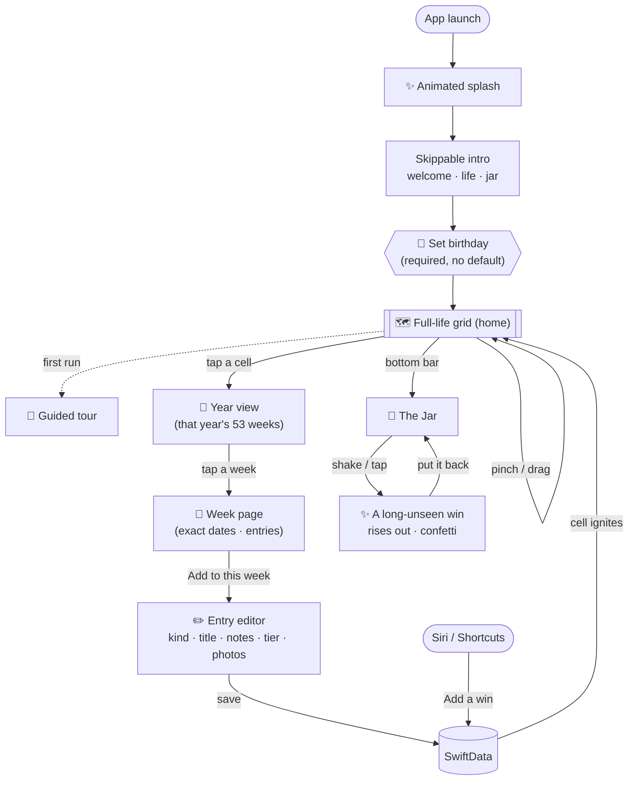
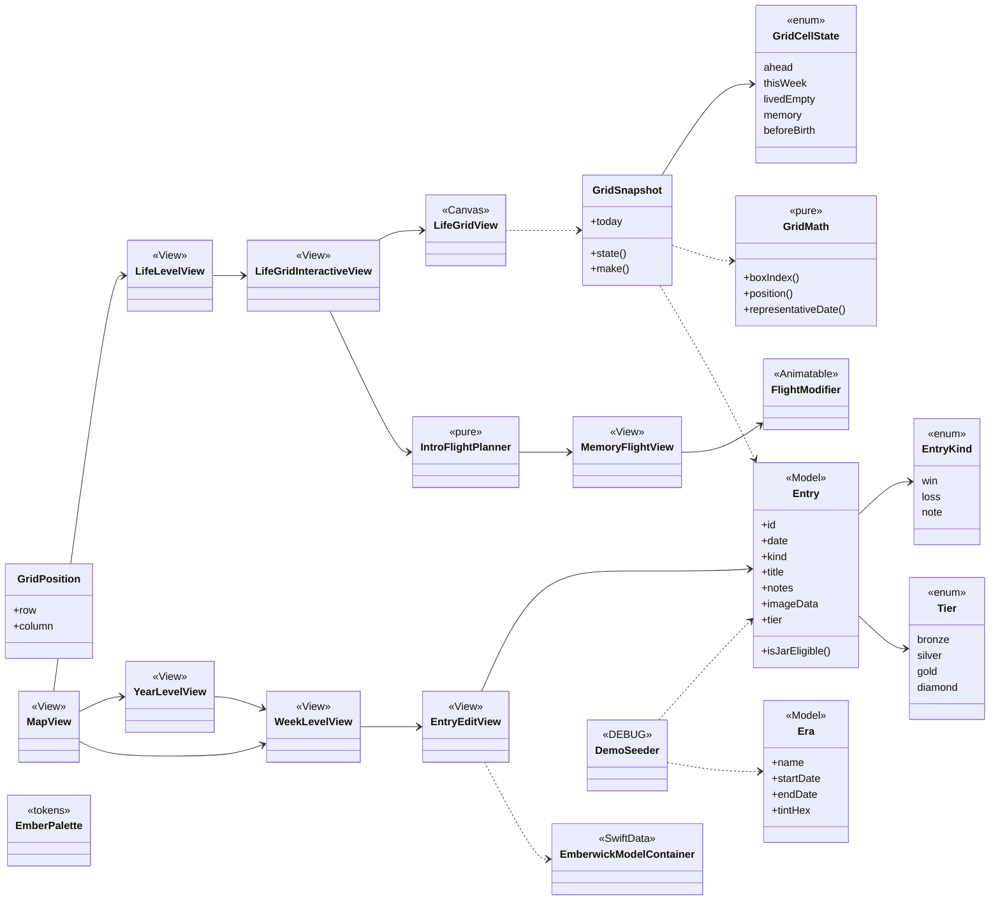

# 🔥 Emberwick

> **A warm, private map of your life — one good week at a time.**

Emberwick turns your life into a grid where **every week you've lived is a square, and the good ones light up.** Capture wins, hard moments, and small notes; each one lands on the week it happened, and the map slowly fills with light. Shake the **Jar** to relive a memory you'd forgotten — with context ("this was ~2 years ago").

*A wick carries the flame; each memory is a small light you keep lit.*

Built for iOS with SwiftUI + SwiftData, iPhone-first, **private and on-device**.

---

## 👤 Who it's for

- **The person:** a thoughtful adult whose weeks blur together — *"where did the year even go?"* — and who quietly discounts their own progress.
- **The situation:** the end of a long week, or a flat day, when the honest feeling is *"I haven't really done anything."*
- **The problem:** the good stuff is real but **invisible** — scattered across the camera roll and memory, never seen in one place. Streak-and-metrics apps pile on guilt; journaling is a chore few sustain.
- **The value:** a 10-second capture that (a) lights up the exact week on a map of your whole life, and (b) *comes back to you* later — a shake, or a home-screen glance, resurfaces a good moment you'd forgotten, **with when it happened**. Quiet proof your life is fuller than it feels.

---

## 📸 See it

| Life map (wins glow, eras band, "a year ago") | A week (exact dates) | The Jar |
|---|---|---|
|  |  |  |
| **Onboarding** | **Guided tour** | **Splash** |
|  |  |  |

---

## ✨ What makes it special

Emberwick fuses two ideas that are weak alone:

- **Life in Weeks** — your whole life as a grid (1 box = 1 week, ~90 rows). Beautiful, but static.
- **The Jar** — collect tiny wins, shake to relive a random one. A real payoff, but contextless.

**The insight:** the Jar is the *input*, the grid is the *view*. Every win you drop also lights up its week on the map. Two views of the same life.

**Guiding principles**
- 🕯️ **Warm, not morbid** — "look how much good has happened, and how much blank canvas is left." Never a death countdown.
- 🌱 **No guilt** — no streaks, no nagging, no obligation. Returning is a pleasure.
- 💛 **Your own life is the motivation** — never generic quotes.
- 🔒 **Private by default** — on-device first; no accounts to start.

---

## 🎯 Important features

| Feature | Description |
|---|---|
| **Full-life grid** | 53 weeks × ~90 years, drawn with a single `Canvas` for performance. Wins glow in their tier color. |
| **Exact week math** | Day-of-year 7-day boxes (`boxIndex = (dayOfYear − 1) / 7`) — a January date never leaks into the prior year's row. Each week page shows its **precise date range** ("20–26 May 2020"). |
| **Pinch-zoom + zoom nav** | Magnify the poster (the Canvas redraws crisply); tap a cell → its **year** → a **week** via native `.navigationTransition(.zoom)` flights. |
| **Entries & tiers** | One unified `win` / `loss` / `note` with title, notes, photos, date; wins get an optional one-tap **tier** (bronze → silver → gold → 💎 diamond). |
| **Eras** | Soft, low-saturation tint bands behind the grid (a span) so bright wins (points) always pop above. |
| **The Jar** | Shake (or tap) and a weighted, long-unseen win rises out of the jar, grows, and is revealed with **tier-scaled confetti + haptics**; "Put it back" sends it home. Never deletes. |
| **Resurfacing** | A gentle *"you did this a year ago"* card, shown once so it never nags. |
| **Required birthday** | The grid anchors to your real birthday (exact date, or just month & year) — **no default is ever assumed**. |
| **First-run** | Animated splash (memories fly into the mark), a skippable value-prop intro, and a one-time **guided spotlight tour**. |
| **Capture anywhere** | *"Add a win to Emberwick"* via **Siri, Spotlight, and Shortcuts** (App Intents). |
| **Home-screen widget** | A glanceable *"a year ago"* / this-week nudge (WidgetKit + App Group). |
| **Backup & restore** | Export everything to a private JSON file and import it back on a new phone — your birthday travels with it. |

---

## 🚦 Status — complete

Emberwick is **fully built and running** on iOS 26 / Swift 6. The whole loop works end to end, the app icon and brand mark are in, and the pure core is covered by **23 green unit tests**.

Everything below is shipped and in the app:

- ✅ Full-life grid · pinch-zoom · life → year → week zoom navigation
- ✅ Entries (win / loss / note) · tiers · photos · eras
- ✅ The Jar — weighted shake, staged reveal, tier confetti + haptics, "put it back"
- ✅ Resurfacing ("a year ago") · adaptive home · Settings
- ✅ Required birthday (exact or month/year) · birth-anchored grid
- ✅ Animated splash · brand logo/app icon · skippable onboarding · guided tour · sounds
- ✅ App Intent ("Add a win") · home-screen widget · JSON export **and** import/restore
- ✅ Accessibility — Dynamic Type, VoiceOver, Reduce Motion; 100% on-device & private

*(Built in independently-testable phases — see [`BUILD_PLAN.md`](BUILD_PLAN.md).)*

---

## 🧭 User flow



---

## 🏗️ Architecture (class / view view)

Pure functional core (grid math, snapshot, planners, selectors) with impurity pushed to the edges (SwiftData, photos, haptics). One type per file, feature-based folders. The diagram below highlights the **grid + animation core**; the Jar, resurfacing, onboarding, tour, export, and widget follow the same pure-core / thin-view pattern.



### Source layout

```
Emberwick/
├── App/            AppConfig · RootView · SoundPlayer · tabs / home mode
├── Models/         Entry · Era · EntryKind · Tier · BirthdayWin        (domain, pure)
├── Grid/           GridMath · GridSnapshot · Canvas grid, life/year views, MapView + zoom
├── Week/           WeekLevelView · EntryEditView · rows, pills, era chip
├── Jar/            JarView · JarSelector · RevealView · ConfettiView · ShakeDetector
├── Eras/           EraListView · EraEditView · tint bands
├── Resurfacing/    ResurfacingSelector · ResurfacingCard
├── Onboarding/     OnboardingFlow · BirthdayGate · BirthdayField · FirstWinStep
├── Tour/           Tour · TourOverlay              (guided spotlight)
├── Brand/          EmberLogo · SplashView · IconExporter
├── Animation/      MemoryFlightView · FlightModifier · intro planner/overlay
├── Export/         EmberExport / EmberExporter     (JSON export + restore)
├── Intents/        AddWinIntent                    (Siri / Shortcuts)
├── Widget/         WidgetBridge                    (App Group snapshot)
├── Settings/       SettingsView
├── DesignSystem/   EmberPalette · Typography · Spacing · Radius · styles (tokens)
├── Persistence/    EmberwickModelContainer (SwiftData)
├── DevTools/       DemoPersona · DemoSeeder (seeded, #if DEBUG)
└── Utilities/      ImageCompression
EmberwickWidget/    Home-screen widget target (WidgetKit)
EmberwickTests/     GridMathTests · CoreLogicTests   (23 tests, Swift Testing)
```

---

## 🛠️ Tech stack

Native Apple frameworks, each earning its place:

- **SwiftUI** — grid `Canvas`, `matchedTransitionSource` + `.navigationTransition(.zoom)`, `MagnifyGesture`, `Animatable` flight motion, `TimelineView` confetti.
- **SwiftData** — on-device persistence (a single shared container the app *and* the App Intent write to).
- **WidgetKit** — home-screen "a year ago" / this-week widget, fed by an App Group snapshot.
- **App Intents** — "Add a win" from Siri, Spotlight, and Shortcuts.
- **Core Motion** — shake-to-reveal in the Jar.
- **PhotosUI** — image attachment (compressed on import).
- **Transferable + `ShareLink`** — private JSON data export.
- **`ImageRenderer`** — the app icon is rendered from the same in-app brand mark.
- **Accessibility** — Dynamic Type throughout, VoiceOver, Reduce Motion, `sensoryFeedback` haptics.
- **Target:** iOS 26 · Swift 6.

## 🎨 Design system

Deliberately **not** the cream + serif + terracotta AI cliché. Warm and energetic; the four tiers *are* the palette, chrome stays warm-neutral, and **glow is the signature** (memories emit light).

| Token | Hex | | Token | Hex |
|---|---|---|---|---|
| paper | `#FDF6EE` | | accent | `#F0567A` |
| ink | `#34262C` | | bronze | `#C0763A` |
| ink-soft | `#7B6A6F` | | silver | `#98A0AD` |
| gold | `#F2A72C` | | diamond | `#31BFD6` |

---

## 🚀 Run it in 60 seconds

```bash
open Emberwick.xcodeproj      # Xcode 26+
# Run the Emberwick scheme on an iOS 26 simulator or device.
```

First launch: animated splash → a short **skippable** intro → a **required birthday** (the grid can't place your weeks without it, and no default is ever assumed) → the app, then a one-time **guided tour** of the map, tiers, eras, and jar. A DEBUG demo persona is seeded so the grid is alive immediately. Handy flags: `-skipSplash`, `-onboard` (replay intro), `-tour` (replay tour), `-noTour`.

**The core loop to try:**
1. **Map** → pinch into a year → tap a week → **Add to this week** (title + optional tier). The week lights up on the map.
2. **Jar** → **Shake for a memory** (or tap) → a win rises out, grows, and is revealed *with when it happened* → **Put it back**.
3. **Siri/Shortcuts:** "Add a win to Emberwick."
4. **Settings** → **Export / restore your data**, **Take a tour**, sound toggle, edit birthday.

## ♿️ Accessibility & privacy

- **Dynamic Type** everywhere — all text scales from one semantic token set (`EmberTypography`).
- **VoiceOver** — the grid speaks a live summary (weeks lived, wins glowing); the Jar reveal is auto-focused and read aloud; the tour is modal and narrated.
- **Reduce Motion** — every animation (flights, staged reveal, confetti, splash) has a calm fallback.
- **Private by default** — 100% on-device, no accounts, no network. Your data leaves the phone only if *you* tap Export.

## 🏠 Home-screen widget

The `EmberwickWidget` extension shows a glanceable *"a year ago"* win (or a this-week nudge). The app publishes a small snapshot to a shared **App Group** (`group.testing.Emberwick`); the widget reads it — no SwiftData access needed, so it stays fast and private.

## ✅ Tested

The pure decision core is covered by fast, deterministic unit tests (Swift Testing, fixed UTC calendar + seeded RNG) — run with **⌘U**:

- Day-of-year **week mapping** and exact **date ranges** (leap years, the sliver box, round-trips).
- **Cell state** — before-birth, this-week, ahead, highest-tier memory, and pre-birth hiding.
- **Jar** weighting favors long-unseen wins; **resurfacing** picks the right anniversary and excludes seen / same-year / future.
- **Export & restore** — well-formed JSON, id-based upsert (no duplicates), birthday round-trip, and duplicate birth-marker collapse.

*23 tests across 6 suites, all green.*

## 🧭 Deliberate trade-offs

Scoped choices, not loose ends — each is a conscious call for a focused v1:

- **iPhone-first.** The layout targets iPhone; iPad is a later adaptation.
- **Day-of-year weeks** (not ISO) — a deliberate trade so a January date never leaks into the prior year's row.
- **Grid VoiceOver is summary-level** — the `Canvas` speaks a live overview; the accessible route to a specific memory is the Jar and week list (per-cell navigation is a planned enhancement).
- **Backup is manual** — export/import a private JSON file (photos stay on-device). Fully offline and account-free by design.

## 🔭 Roadmap

Natural next steps once past v1 — the groundwork is already in place:

- **iCloud sync** — same Apple ID, new phone, data just appears. SwiftData is CloudKit-ready; it's a configuration + model-default change (no sync code).
- **Per-cell grid VoiceOver** — full rotor navigation across weeks and wins.
- **iPad & Mac Catalyst** layouts.
- **Photos in export** and a lightweight loss → win "threads" view.

## 📚 More docs

- [`EMBERWICK.md`](EMBERWICK.md) — full product + technical spec.
- [`BUILD_PLAN.md`](BUILD_PLAN.md) — phased, testable roadmap.

---

<sub>Private, on-device, and warm by design. 🕯️</sub>
