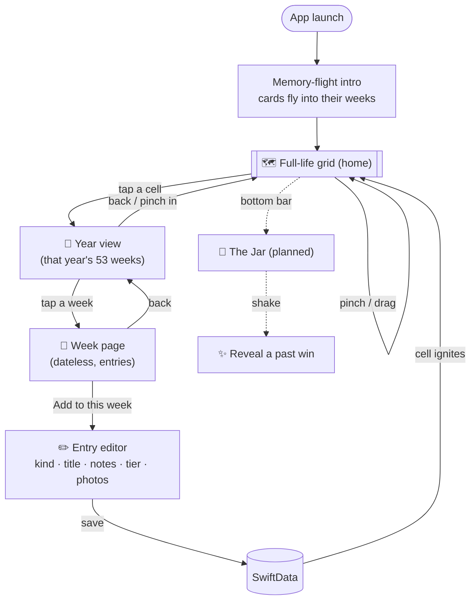
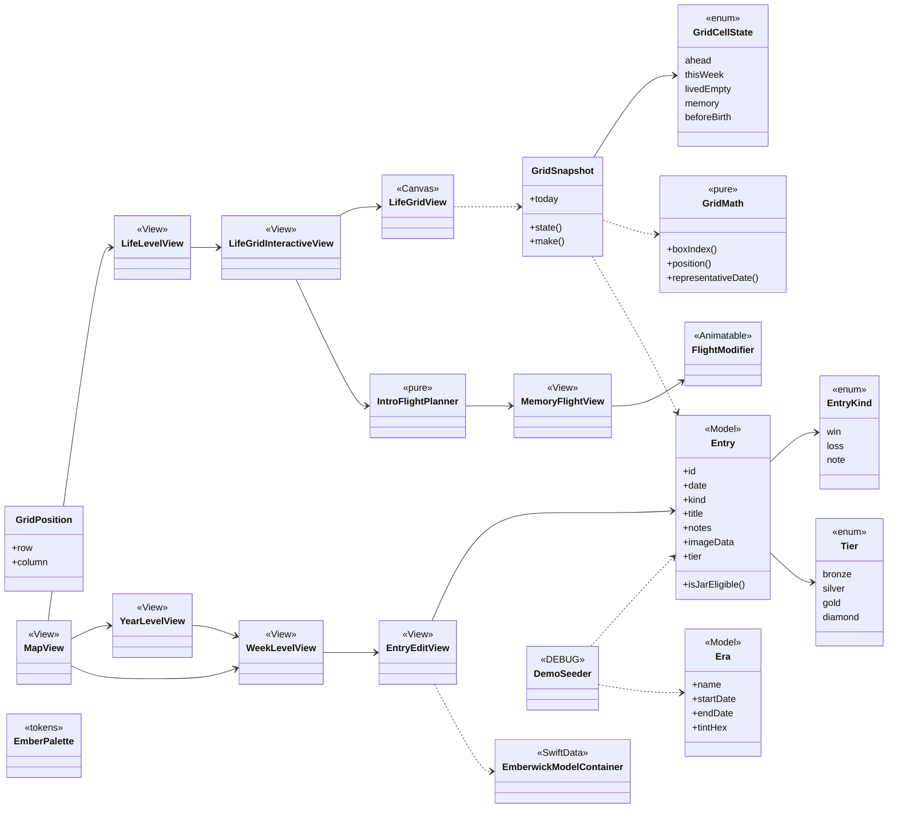

# 🔥 Emberwick

> **A warm, private map of your life — one good week at a time.**

Emberwick turns your life into a grid where **every week you've lived is a square, and the good ones light up.** Capture wins, hard moments, and small notes; each one lands on the week it happened, and the map slowly fills with light. Shake the **Jar** to relive a memory you'd forgotten — with context ("this was ~2 years ago").

*A wick carries the flame; each memory is a small light you keep lit.*

Built for iOS with SwiftUI + SwiftData, iPhone-first, **private and on-device**.

---

## 👤 Who it's for

- **The person:** a thoughtful adult whose weeks blur together — *"where did the year even go?"* — and who quietly discounts their own progress.
- **The situation:** the end of a long week, or a flat day, when the honest feeling is *"I haven't really done anything."*
- **The problem:** the good stuff is real but **invisible** — scattered across the camera roll and memory, never seen in one place. Streak-and-metrics apps pile on guilt; journaling is a chore few sustain.
- **The value:** a 10-second capture that (a) lights up the exact week on a map of your whole life, and (b) *comes back to you* later — a shake, or a home-screen glance, resurfaces a good moment you'd forgotten, **with when it happened**. Quiet proof your life is fuller than it feels.

---

## ✨ What makes it special

Emberwick fuses two ideas that are weak alone:

- **Life in Weeks** — your whole life as a grid (1 box = 1 week, ~90 rows). Beautiful, but static.
- **The Jar** — collect tiny wins, shake to relive a random one. A real payoff, but contextless.

**The insight:** the Jar is the *input*, the grid is the *view*. Every win you drop also lights up its week on the map. Two views of the same life.

**Guiding principles**
- 🕯️ **Warm, not morbid** — "look how much good has happened, and how much blank canvas is left." Never a death countdown.
- 🌱 **No guilt** — no streaks, no nagging, no obligation. Returning is a pleasure.
- 💛 **Your own life is the motivation** — never generic quotes.
- 🔒 **Private by default** — on-device first; no accounts to start.

---

## 🎯 Important features

| Feature | Description |
|---|---|
| **Full-life grid** | 53 weeks × ~90 years, drawn with a single `Canvas` for performance. Memories glow in their tier color. |
| **Day-of-year week math** | `boxIndex = (dayOfYear − 1) / 7` — a January date never leaks into the previous year's row (ISO weeks rejected). |
| **Pinch-zoom + pan** | Crisp magnify of the poster (the Canvas redraws at zoom), one row always = one year. |
| **Zoom navigation** | Tap a cell → its **year** → a **week**, via native `.navigationTransition(.zoom)` flights. |
| **Week page with exact dates** | Calm, full-screen page showing the week's precise range (e.g. "20–26 May 2020"), an era chip, its entries, and "Add to this week." |
| **One unified entry** | `win` / `loss` / `note` — shared title/notes/images/date; wins get an optional one-tap **tier** (bronze → silver → gold → 💎 diamond). |
| **Eras** | Soft, low-saturation tint bands behind the grid (a span), so bright wins (points) always pop above. |
| **Memory-flight intro** | On launch, 15–25 memory cards fly up from the bottom and tuck into their weeks — reusable for the Jar reveal. |
| **The Jar** *(planned)* | Weighted shake surfaces a long-unseen win with tier-scaled delight; never deletes. |
| **Local-first storage** | SwiftData now; CloudKit sync + JSON export as fast-follow. |

---

## 🚦 Current progress

Built in independently-testable phases (see [`BUILD_PLAN.md`](BUILD_PLAN.md)):

| Phase | Feature | Status |
|---|---|---|
| 0 | Foundation — design tokens, models, grid math (verified) | ✅ Done |
| 1 | Full-life grid render (seeded demo persona) | ✅ Done |
| 2 | Zoom navigation (life → year → week) | ✅ Done |
| 3 | Week page + add/edit entries (with photos) | ✅ Done |
| ✨ | Signature memory-flight intro animation | ✅ Done |
| 4 | Eras (create + tint bands) | ⬜ Planned |
| 5 | The Jar (shake + reveal + haptics) | ⬜ Planned |
| 6 | Adaptive home + Settings | ⬜ Planned |
| 7 | Resurfacing ("you did this a year ago") | ⬜ Planned |
| 8 | Onboarding + polish pass | ⬜ Planned |
| 9 | Ship prep (icon, metadata, TestFlight) | ⬜ Planned |
| F | Future: CloudKit sync, export, loss→win threads, widget | 🔮 Later |

**Verified:** builds clean (iOS 26 / Swift 6), grid-math unit tests green, core loop runs in the simulator.

---

## 🧭 User flow



---

## 🏗️ Architecture (class / view view)

Pure functional core (grid math, snapshot, planners) with impurity pushed to the edges (SwiftData, photos, haptics). One type per file, feature-based folders.



### Source layout

```
Emberwick/
├── App/            AppConfig
├── Models/         Entry · Era · EntryKind · Tier            (domain, pure)
├── Grid/           GridMath · GridSnapshot · GridConstants · Canvas grid,
│                   life/year/week views, MapView + zoom routing
├── Week/           WeekLevelView · EntryEditView · rows, pills, era chip
├── Animation/      MemoryFlightView · FlightModifier · intro planner/overlay
├── DesignSystem/   EmberPalette · Typography · Spacing · Radius · styles (tokens)
├── Persistence/    EmberwickModelContainer (SwiftData)
├── DevTools/       DemoPersona · DemoSeeder (seeded, #if DEBUG)
└── Utilities/      ImageCompression
EmberwickTests/     GridMathTests
```

---

## 🛠️ Tech stack

Native Apple frameworks, each earning its place:

- **SwiftUI** — grid `Canvas`, `matchedTransitionSource` + `.navigationTransition(.zoom)`, `MagnifyGesture`, `Animatable` flight motion, `TimelineView` confetti.
- **SwiftData** — on-device persistence (a single shared container the app *and* the App Intent write to).
- **WidgetKit** — home-screen "a year ago" / this-week widget, fed by an App Group snapshot.
- **App Intents** — "Add a win" from Siri, Spotlight, and Shortcuts.
- **Core Motion** — shake-to-reveal in the Jar.
- **PhotosUI** — image attachment (compressed on import).
- **Transferable + `ShareLink`** — private JSON data export.
- **`ImageRenderer`** — the app icon is rendered from the same in-app brand mark.
- **Accessibility** — Dynamic Type throughout, VoiceOver, Reduce Motion, `sensoryFeedback` haptics.
- **Target:** iOS 26 · Swift 6.

## 🎨 Design system

Deliberately **not** the cream + serif + terracotta AI cliché. Warm and energetic; the four tiers *are* the palette, chrome stays warm-neutral, and **glow is the signature** (memories emit light).

| Token | Hex | | Token | Hex |
|---|---|---|---|---|
| paper | `#FDF6EE` | | accent | `#F0567A` |
| ink | `#34262C` | | bronze | `#C0763A` |
| ink-soft | `#7B6A6F` | | silver | `#98A0AD` |
| gold | `#F2A72C` | | diamond | `#31BFD6` |

---

## 🚀 Run it in 60 seconds

```bash
open Emberwick.xcodeproj      # Xcode 26+
# Run the Emberwick scheme on an iOS 26 simulator or device.
```

First launch: animated splash → a short **skippable** intro → a **required birthday** (the grid can't place your weeks without it, and no default is ever assumed) → the app, then a one-time **guided tour** of the map, tiers, eras, and jar. A DEBUG demo persona is seeded so the grid is alive immediately. Handy flags: `-skipSplash`, `-onboard` (replay intro), `-tour` (replay tour), `-noTour`.

**The core loop to try:**
1. **Map** → pinch into a year → tap a week → **Add to this week** (title + optional tier). The week lights up on the map.
2. **Jar** → **Shake for a memory** (or tap) → a win rises out, grows, and is revealed *with when it happened* → **Put it back**.
3. **Siri/Shortcuts:** "Add a win to Emberwick."
4. **Settings** → **Export my data**, **Take a tour**, sound toggle, edit birthday.

## ♿️ Accessibility & privacy

- **Dynamic Type** everywhere — all text scales from one semantic token set (`EmberTypography`).
- **VoiceOver** — the grid speaks a live summary (weeks lived, wins glowing); the Jar reveal is auto-focused and read aloud; the tour is modal and narrated.
- **Reduce Motion** — every animation (flights, staged reveal, confetti, splash) has a calm fallback.
- **Private by default** — 100% on-device, no accounts, no network. Your data leaves the phone only if *you* tap Export.

## 🏠 Home-screen widget (one Xcode step)

Widget code lives in [`EmberwickWidget/`](EmberwickWidget/) and reads a snapshot the app publishes. To enable: **File ▸ New ▸ Target ▸ Widget Extension** named `EmberwickWidget`, point it at that folder, and add the App Group `group.testing.Emberwick` to **both** the app and the widget target.

## ⚠️ Honest limitations

- Grid **per-week** VoiceOver is summary-level (the `Canvas` isn't a per-cell a11y tree yet); the accessible route to a specific memory is the Jar / week list.
- Weeks are fixed **day-of-year** 7-day boxes (not ISO weeks) — a deliberate trade so a January date never leaks into the prior year's row.
- On-device only; **no cloud sync/backup** yet (Export is the backup). SwiftData is CloudKit-ready for a fast-follow.
- The widget needs the one-time target step above.

## 📚 More docs

- [`EMBERWICK.md`](EMBERWICK.md) — full product + technical spec.
- [`BUILD_PLAN.md`](BUILD_PLAN.md) — phased, testable roadmap.

---

<sub>Private, on-device, and warm by design. 🕯️</sub>
